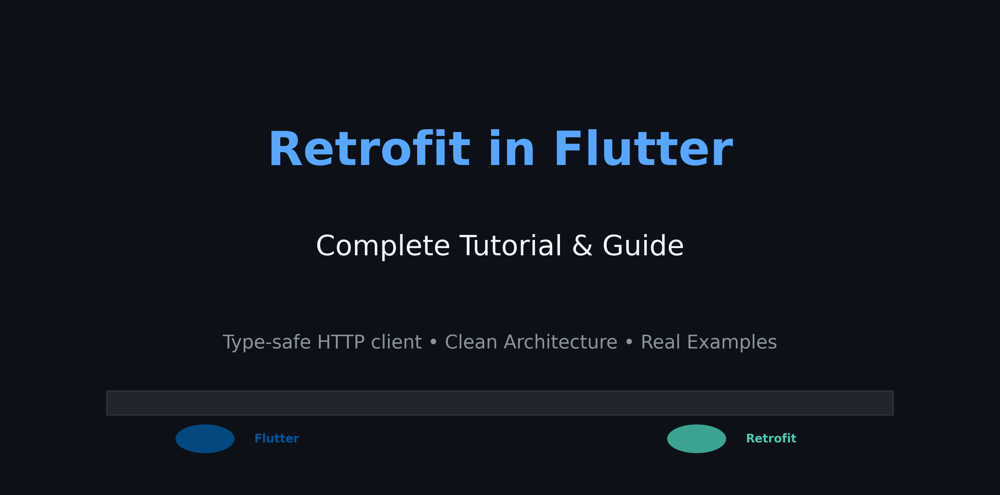

# Retrofit Tutorial for Flutter - Complete Guide



## 📚 Table of Contents

1. [Introduction](#introduction)
2. [What is Retrofit?](#what-is-retrofit)
3. [Setup and Dependencies](#setup-and-dependencies)
4. [Basic API Service](#basic-api-service)
5. [Model Classes and Serialization](#model-classes-and-serialization)
6. [Advanced Features](#advanced-features)
7. [Error Handling](#error-handling)
8. [Best Practices](#best-practices)
9. [Real Examples from BocApp](#real-examples-from-bocapp)
10. [Exercises and Challenges](#exercises-and-challenges)

## 🚀 Introduction

Welcome to the comprehensive Retrofit tutorial for Flutter! This guide will teach you how to implement robust API communication in your Flutter apps using Retrofit - a type-safe HTTP client for Dart.

This tutorial is based on real-world implementation from the **BocApp** project, providing practical examples you can apply immediately in your projects.

## 🔍 What is Retrofit?

Retrofit is a type-safe HTTP client for Dart that makes API calls simple and maintainable. It generates implementation code for your API interfaces at compile time, reducing boilerplate and potential runtime errors.

### Key Benefits:
- ✅ **Type Safety**: Compile-time checking of API calls
- ✅ **Code Generation**: Automatic implementation generation
- ✅ **Clean Architecture**: Separation of concerns
- ✅ **Easy Testing**: Mockable interfaces
- ✅ **Dio Integration**: Powerful HTTP client underneath

## 📦 Setup and Dependencies

### Step 1: Add Dependencies

Add these dependencies to your `pubspec.yaml`:

```yaml
dependencies:
  # HTTP client
  dio: ^5.8.0+1
  
  # Retrofit
  retrofit: ^4.4.2
  
  # JSON serialization
  json_annotation: ^4.9.0
  
  # Freezed for immutable models
  freezed_annotation: ^2.4.1

dev_dependencies:
  # Code generation
  build_runner: ^2.5.3
  retrofit_generator: ^9.2.0
  json_serializable: ^6.9.5
  freezed: ^2.4.5
  
  # Optional: Pretty logging
  pretty_dio_logger: ^1.4.0
```

### Step 2: Run Code Generation

```bash
flutter packages pub run build_runner build
```

## 🏗️ Basic API Service

Let's create your first API service! We'll start with a simple authentication service.

### Step 1: Define API Constants

```dart
// lib/core/networking/api_constants.dart
class ApiConstants {
  static const String apiBaseUrl = 'https://api.example.com/v1/';
  static const String login = 'auth/login';
  static const String register = 'auth/register';
  static const String userProfile = 'user/profile';
}
```

### Step 2: Create Request/Response Models

```dart
// lib/features/auth/data/models/login_request.dart
import 'package:json_annotation/json_annotation.dart';

part 'login_request.g.dart';

@JsonSerializable()
class LoginRequest {
  final String email;
  final String password;

  const LoginRequest({
    required this.email,
    required this.password,
  });

  factory LoginRequest.fromJson(Map<String, dynamic> json) =>
      _$LoginRequestFromJson(json);

  Map<String, dynamic> toJson() => _$LoginRequestToJson(this);
}
```

```dart
// lib/features/auth/data/models/login_response.dart
import 'package:json_annotation/json_annotation.dart';

part 'login_response.g.dart';

@JsonSerializable()
class LoginResponse {
  final String token;
  final User user;
  final String message;

  const LoginResponse({
    required this.token,
    required this.user,
    required this.message,
  });

  factory LoginResponse.fromJson(Map<String, dynamic> json) =>
      _$LoginResponseFromJson(json);

  Map<String, dynamic> toJson() => _$LoginResponseToJson(this);
}

@JsonSerializable()
class User {
  final int id;
  final String name;
  final String email;

  const User({
    required this.id,
    required this.name,
    required this.email,
  });

  factory User.fromJson(Map<String, dynamic> json) => _$UserFromJson(json);
  Map<String, dynamic> toJson() => _$UserToJson(this);
}
```

### Step 3: Create the API Service

```dart
// lib/features/auth/data/api/auth_api_service.dart
import 'package:dio/dio.dart';
import 'package:retrofit/retrofit.dart';
import '../models/login_request.dart';
import '../models/login_response.dart';
import '../../../../core/networking/api_constants.dart';

part 'auth_api_service.g.dart';

@RestApi(baseUrl: ApiConstants.apiBaseUrl)
abstract class AuthApiService {
  factory AuthApiService(Dio dio, {String baseUrl}) = _AuthApiService;

  @POST(ApiConstants.login)
  Future<LoginResponse> login(@Body() LoginRequest loginRequest);

  @GET(ApiConstants.userProfile)
  Future<User> getUserProfile(@Header('Authorization') String token);

  @POST(ApiConstants.register)
  Future<LoginResponse> register(@Body() RegisterRequest registerRequest);
}
```

## 🎯 Advanced Features

### Query Parameters

```dart
@GET('/posts')
Future<List<Post>> getPosts(
  @Query('page') int page,
  @Query('limit') int limit,
  @Query('category') String? category,
);
```

### Path Parameters

```dart
@GET('/users/{id}')
Future<User> getUserById(@Path('id') int userId);

@DELETE('/posts/{id}')
Future<void> deletePost(@Path('id') int postId);
```

### Headers

```dart
@GET('/protected-data')
Future<ProtectedData> getProtectedData(
  @Header('Authorization') String token,
  @Header('Content-Type') String contentType,
);

// Or use @Headers for static headers
@Headers({'Content-Type': 'application/json'})
@POST('/data')
Future<Response> sendData(@Body() MyData data);
```

### File Uploads

```dart
@POST('/upload')
@MultiPart()
Future<UploadResponse> uploadFile(
  @Part() File file,
  @Part('description') String description,
);
```

## 🛠️ Dio Configuration

Create a proper Dio instance with interceptors and configuration:

```dart
// lib/core/networking/dio_factory.dart
import 'package:dio/dio.dart';
import 'package:pretty_dio_logger/pretty_dio_logger.dart';

class DioFactory {
  static Dio create() {
    final dio = Dio();
    
    // Add interceptors
    dio.interceptors.add(_createAuthInterceptor());
    dio.interceptors.add(_createLoggerInterceptor());
    
    // Configure options
    dio.options = BaseOptions(
      connectTimeout: const Duration(seconds: 30),
      receiveTimeout: const Duration(seconds: 30),
      headers: {
        'Content-Type': 'application/json',
        'Accept': 'application/json',
      },
    );
    
    return dio;
  }
  
  static Interceptor _createAuthInterceptor() {
    return InterceptorsWrapper(
      onRequest: (options, handler) async {
        // Add auth token to requests
        final token = await SecureStorage.getToken();
        if (token != null) {
          options.headers['Authorization'] = 'Bearer $token';
        }
        handler.next(options);
      },
    );
  }
  
  static Interceptor _createLoggerInterceptor() {
    return PrettyDioLogger(
      requestHeader: true,
      requestBody: true,
      responseBody: true,
      responseHeader: false,
      error: true,
      compact: true,
    );
  }
}
```

## 🔥 Error Handling

### API Result Pattern

```dart
// lib/core/networking/api_result.dart
import 'package:freezed_annotation/freezed_annotation.dart';

part 'api_result.freezed.dart';

@freezed
class ApiResult<T> with _$ApiResult<T> {
  const factory ApiResult.success(T data) = Success<T>;
  const factory ApiResult.failure(ApiErrorModel errorModel) = Failure<T>;
}
```

### Error Model

```dart
// lib/core/networking/api_error_model.dart
import 'package:json_annotation/json_annotation.dart';

part 'api_error_model.g.dart';

@JsonSerializable()
class ApiErrorModel {
  final String? message;
  final int? code;
  final Map<String, dynamic>? errors;

  const ApiErrorModel({
    this.message,
    this.code,
    this.errors,
  });

  factory ApiErrorModel.fromJson(Map<String, dynamic> json) =>
      _$ApiErrorModelFromJson(json);

  Map<String, dynamic> toJson() => _$ApiErrorModelToJson(this);
}
```

### Repository Pattern with Error Handling

```dart
// lib/features/auth/data/repository/auth_repository.dart
import 'package:dio/dio.dart';
import '../api/auth_api_service.dart';
import '../models/login_request.dart';
import '../models/login_response.dart';
import '../../../../core/networking/api_result.dart';
import '../../../../core/networking/api_error_handler.dart';

class AuthRepository {
  final AuthApiService _apiService;

  AuthRepository(this._apiService);

  Future<ApiResult<LoginResponse>> login(LoginRequest request) async {
    try {
      final response = await _apiService.login(request);
      return ApiResult.success(response);
    } catch (error) {
      return ApiResult.failure(ApiErrorHandler.handle(error));
    }
  }
}
```

## 📱 Real Examples from BocApp

Let's look at how BocApp implements Retrofit in practice:

### 1. Home API Service (Specializations)

```dart
// From lib/features/home/data/apis/home_api_services.dart
@RestApi(baseUrl: ApiConstants.apiBaseUrl)
abstract class HomeApiServices {
  factory HomeApiServices(Dio dio, {String baseUrl}) = _HomeApiServices;

  @GET(HomeApiConstants.specializationEP)
  Future<SpecializationsResponseModel> getSpecialization();
}
```

### 2. Stripe Payment Service

```dart
// From lib/core/networking/stripe/stripe_api_service.dart
@RestApi(baseUrl: 'https://api.stripe.com/v1/')
abstract class StripeApiService {
  factory StripeApiService(Dio dioInstance) = _StripeApiService;

  @POST('payment_intents')
  Future<StripeResponseModel> createPaymentIntent(
    @Body() StripeRequestModel stripeRequestModel,
  );

  @POST('ephemeral_keys')
  @Headers({
    'Stripe-Version': '2025-04-30.basil',
  })
  Future<EphemeralKeyResponseModel> createEphemeralKey(
    @Field('customer') String customerId,
  );
}
```

## 🏆 Best Practices

### 1. Separate API Services by Feature
- ✅ Create separate API services for different features
- ✅ Keep related endpoints together
- ✅ Use consistent naming conventions

### 2. Use Proper Error Handling
- ✅ Implement repository pattern
- ✅ Use result types (Success/Failure)
- ✅ Handle different error scenarios

### 3. Model Organization
- ✅ Separate request and response models
- ✅ Use JsonSerializable for code generation
- ✅ Include proper validation

### 4. Testing
- ✅ Mock API services in tests
- ✅ Test error scenarios
- ✅ Use dependency injection

## 🎓 Exercises and Challenges

### Exercise 1: Create a Todo API Service
Create a complete API service for managing todos with CRUD operations.

### Exercise 2: Implement Pagination
Add pagination support to a list endpoint with proper query parameters.

### Exercise 3: File Upload
Implement a file upload endpoint with progress tracking.

### Exercise 4: Offline Support
Add caching and offline support to your API calls.

## 🔗 Next Steps

1. **Implement authentication flow**
2. **Add refresh token mechanism**
3. **Create comprehensive error handling**
4. **Add offline support with caching**
5. **Implement API mocking for testing**

## 📚 Additional Resources

- [Retrofit Documentation](https://pub.dev/packages/retrofit)
- [Dio Documentation](https://pub.dev/packages/dio)
- [JSON Serialization in Flutter](https://docs.flutter.dev/development/data-and-backend/json)
- [BlocApp Source Code](https://github.com/abood-sh/BocApp)

---

**Happy coding! 🚀**

*This tutorial is based on the real-world implementation in BocApp. Feel free to explore the codebase for more examples and patterns.*